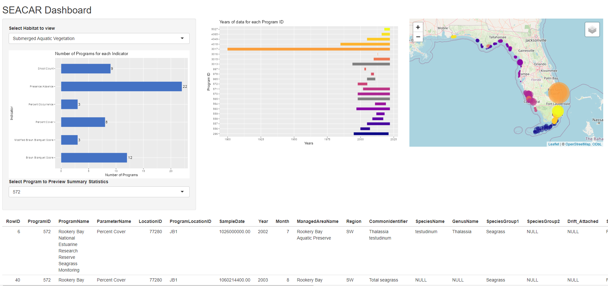
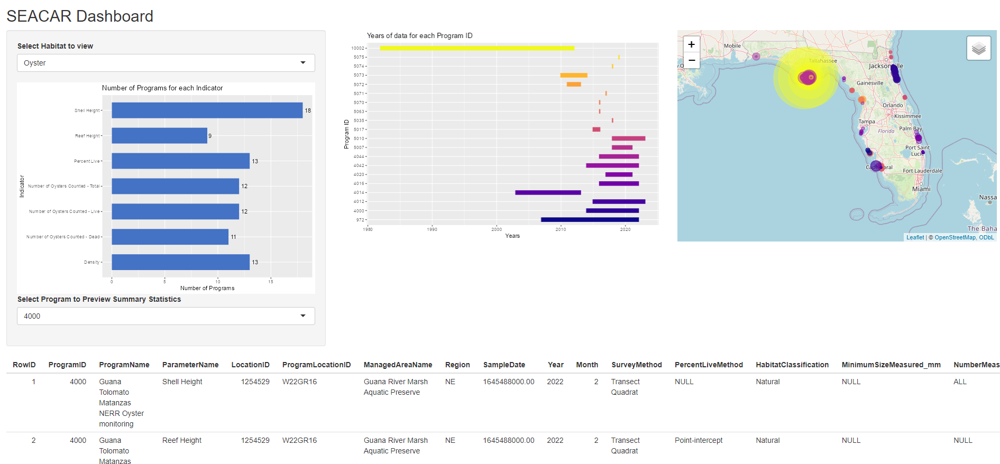

# SEACAR-dashboard

The purpose of this repository is to serve as a preliminary exploration of an all-encompassing data dashboard for the SEACAR database.

## app.R
*app.R* is used to launch an interactive Shiny app which allows the exploration of various habitats within the *SEACAR* ecosystem, including the following features:  
* A list of indicators available for a given habitat, with the number of programs that collect data for each indicator
* A timeline showing the years of data available for each program
* An interactive map containing details of sampling site information, color-coded by program
  + Pop-up boxes contain further information for each sample site; including Parameters Measured, Years, Total amount of data collected
* A table below provides a print-out of the first 10 entries for each habitat within the combined data tables

With *Submerged Aquatic Vegetation* selected:  

  

With *Oyster* selected:  

